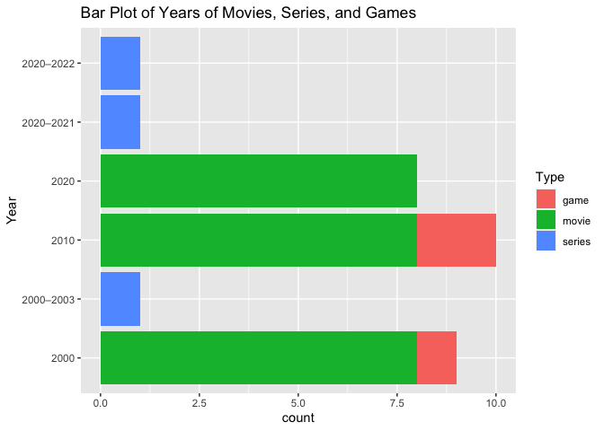
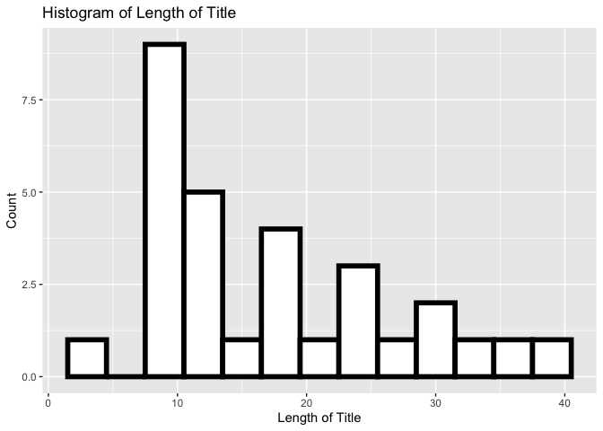
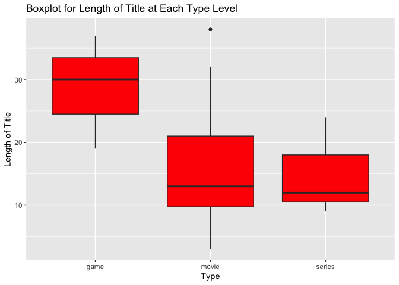
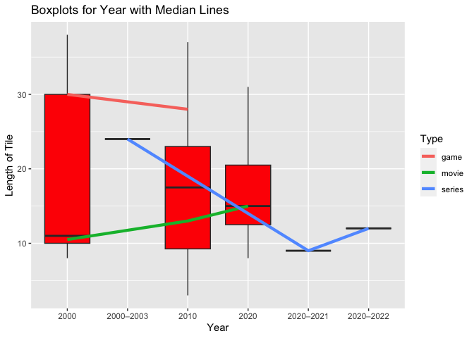
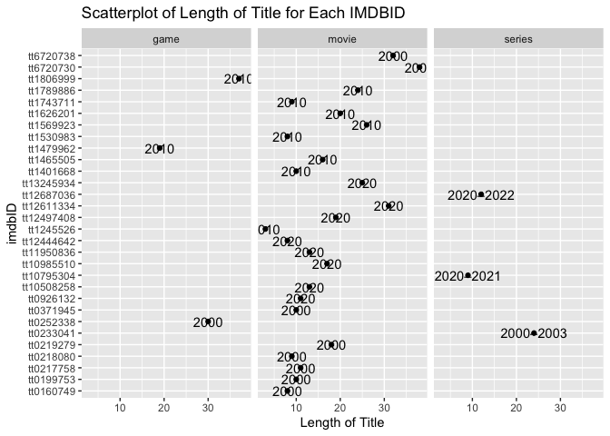
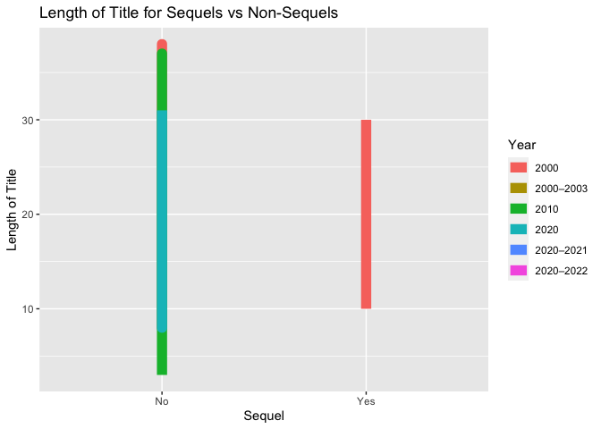

Vignette Project
================
Jessica Ayers
2023-06-22

# Packages Needed

The packages needed for analysis of the Open Movie Database API are:

- `httr`
- `tidyverse`
- `jsonlite`
- `GGally`

``` r
library(httr)
library(jsonlite)
library(tidyverse)
library(GGally)
```

# Functions

The API used was the Open Movie Database API. Two different types of
data were returned based on parameters used in the link. With the below
function, a list of information corresponding to one random movie will
returned along with a data frame of 10 random movies with more limited
information. The data frame will be used to do the exploratory data
analysis. For this API, movies with different colors in the titles will
be returned for three different release years. The 6 choices are:

- Options for `s` include *blue*, *red* and *green*
  - `s` searches for movie titles with the provided word
- Options for `y` include *2000*, *2010* and *2020*
  - `y` stands for year of release

There are 9 total combinations of possible modifications.

``` r
contactFunction <- function(s, y){

if((s == "blue") & (y == 2000)) {

blueData <- GET("http://www.omdbapi.com/?s=blue&y=2000&apikey=ca153ce0")
blueParsed <- fromJSON(rawToChar(blueData$content))

bluedf <- data.frame(blueParsed$Search$Title, blueParsed$Search$Year, blueParsed$Search$imdbID, blueParsed$Search$Type)
blue <- bluedf %>%
  as_tibble() %>%
  rename(Title = blueParsed.Search.Title, Year = blueParsed.Search.Year, imdbID = blueParsed.Search.imdbID, Type = blueParsed.Search.Type)

testData <- GET("http://www.omdbapi.com/?t=blue&y=2000&apikey=ca153ce0")
randomData <- fromJSON(rawToChar(testData$content))

return(list(RandomMovie = randomData, RandomDF = blue))
}

else if((s == "blue") & (y == 2010)){
  blueData <- GET("http://www.omdbapi.com/?s=blue&y=2010&apikey=ca153ce0")
  blueParsed <- fromJSON(rawToChar(blueData$content))

  bluedf <- data.frame(blueParsed$Search$Title, blueParsed$Search$Year, blueParsed$Search$imdbID, blueParsed$Search$Type)
  blue <- bluedf %>%
    as_tibble() %>%
    rename(Title = blueParsed.Search.Title, Year = blueParsed.Search.Year, imdbID = blueParsed.Search.imdbID, Type = blueParsed.Search.Type) 

testData <- GET("http://www.omdbapi.com/?t=blue&y=2010&apikey=ca153ce0")
randomData <- fromJSON(rawToChar(testData$content))

return(list(RandomMovie = randomData, RandomDF = blue))
}

else if((s == "blue") & (y == 2020)){
  blueData <- GET("http://www.omdbapi.com/?s=blue&y=2020&apikey=ca153ce0")
blueParsed <- fromJSON(rawToChar(blueData$content))

bluedf <- data.frame(blueParsed$Search$Title, blueParsed$Search$Year, blueParsed$Search$imdbID, blueParsed$Search$Type)
blue <- bluedf %>%
  as_tibble() %>%
  rename(Title = blueParsed.Search.Title, Year = blueParsed.Search.Year, imdbID = blueParsed.Search.imdbID, Type = blueParsed.Search.Type)

testData <- GET("http://www.omdbapi.com/?t=blue&y=2020&apikey=ca153ce0")
randomData <- fromJSON(rawToChar(testData$content))

return(list(RandomMovie = randomData, RandomDF = blue))
}

else if ((s == "red") & (y == 2000)){
  redData <- GET("http://www.omdbapi.com/?s=red&y=2000&apikey=ca153ce0")
redParsed <- fromJSON(rawToChar(redData$content))

reddf <- data.frame(redParsed$Search$Title, redParsed$Search$Year, redParsed$Search$imdbID, redParsed$Search$Type)
red <- reddf %>%
  as_tibble() %>%
  rename(Title = redParsed.Search.Title, Year = redParsed.Search.Year, imdbID = redParsed.Search.imdbID, Type = redParsed.Search.Type)

testData <- GET("http://www.omdbapi.com/?t=red&y=2000&apikey=ca153ce0")
randomData <- fromJSON(rawToChar(testData$content))

return(list(RandomMovie = randomData, RandomDF = red))
}

else if ((s == "red") & (y == 2010)){
  redData <- GET("http://www.omdbapi.com/?s=red&y=2010&apikey=ca153ce0")
redParsed <- fromJSON(rawToChar(redData$content))

reddf <- data.frame(redParsed$Search$Title, redParsed$Search$Year, redParsed$Search$imdbID, redParsed$Search$Type)
red <- reddf %>%
  as_tibble() %>%
  rename(Title = redParsed.Search.Title, Year = redParsed.Search.Year, imdbID = redParsed.Search.imdbID, Type = redParsed.Search.Type) 

testData <- GET("http://www.omdbapi.com/?t=red&y=2010&apikey=ca153ce0")
randomData <- fromJSON(rawToChar(testData$content))

return(list(RandomMovie = randomData, RandomDF = red))
}

else if((s == "red") & (y == 2020)){
  redData <- GET("http://www.omdbapi.com/?s=red&y=2020&apikey=ca153ce0")
redParsed <- fromJSON(rawToChar(redData$content))

reddf <- data.frame(redParsed$Search$Title, redParsed$Search$Year, redParsed$Search$imdbID, redParsed$Search$Type)
red <- reddf %>%
  as_tibble() %>%
  rename(Title = redParsed.Search.Title, Year = redParsed.Search.Year, imdbID = redParsed.Search.imdbID, Type = redParsed.Search.Type) 

testData <- GET("http://www.omdbapi.com/?t=red&y=2020&apikey=ca153ce0")
randomData <- fromJSON(rawToChar(testData$content))

return(list(RandomMovie = randomData, RandomDF = red))
}

else if((s == "green") & (y == 2000)){
  greenData <- GET("http://www.omdbapi.com/?s=green&y=2000&apikey=ca153ce0")
greenParsed <- fromJSON(rawToChar(greenData$content))

greendf <- data.frame(greenParsed$Search$Title, greenParsed$Search$Year, greenParsed$Search$imdbID, greenParsed$Search$Type)
green <- greendf %>%
  as_tibble() %>%
  rename(Title = greenParsed.Search.Title, Year = greenParsed.Search.Year, imdbID = greenParsed.Search.imdbID, Type = greenParsed.Search.Type) 

testData <- GET("http://www.omdbapi.com/?t=green&y=2000&apikey=ca153ce0")
randomData <- fromJSON(rawToChar(testData$content))

return(list(RandomMovie = randomData, RandomDF = green))
}

else if((s== "green") & (y == 2010)){
  greenData <- GET("http://www.omdbapi.com/?s=green&y=2010&apikey=ca153ce0")
greenParsed <- fromJSON(rawToChar(greenData$content))

greendf <- data.frame(greenParsed$Search$Title, greenParsed$Search$Year, greenParsed$Search$imdbID, greenParsed$Search$Type)
green <- greendf %>%
  as_tibble() %>%
  rename(Title = greenParsed.Search.Title, Year = greenParsed.Search.Year, imdbID = greenParsed.Search.imdbID, Type = greenParsed.Search.Type) 

testData <- GET("http://www.omdbapi.com/?t=green&y=2010&apikey=ca153ce0")
randomData <- fromJSON(rawToChar(testData$content))
return(list(RandomMovie = randomData, RandomDF = green))
}

else if((s == "green") & (y == 2020)){
  greenData <- GET("http://www.omdbapi.com/?s=green&y=2020&apikey=ca153ce0")
greenParsed <- fromJSON(rawToChar(greenData$content))

greendf <- data.frame(greenParsed$Search$Title, greenParsed$Search$Year, greenParsed$Search$imdbID, greenParsed$Search$Type)
green <- greendf %>%
  as_tibble() %>%
  rename(Title = greenParsed.Search.Title, Year = greenParsed.Search.Year, imdbID = greenParsed.Search.imdbID, Type = greenParsed.Search.Type) 

testData <- GET("http://www.omdbapi.com/?t=green&y=2020&apikey=ca153ce0")
randomData <- fromJSON(rawToChar(testData$content))

return(list(RandomMovie = randomData, RandomDF = green))
}

else(stop("invalid s or y argument"))

}
```

Some examples of random movie titles returned from the above function
are:

``` r
contactFunction("blue", 2010)$RandomMovie
```

    ## $Title
    ## [1] "Blue Valentine"
    ## 
    ## $Year
    ## [1] "2010"
    ## 
    ## $Rated
    ## [1] "R"
    ## 
    ## $Released
    ## [1] "28 Jan 2011"
    ## 
    ## $Runtime
    ## [1] "112 min"
    ## 
    ## $Genre
    ## [1] "Drama, Romance"
    ## 
    ## $Director
    ## [1] "Derek Cianfrance"
    ## 
    ## $Writer
    ## [1] "Derek Cianfrance, Joey Curtis, Cami Delavigne"
    ## 
    ## $Actors
    ## [1] "Ryan Gosling, Michelle Williams, John Doman"
    ## 
    ## $Plot
    ## [1] "The relationship of a contemporary married couple, charting their evolution over a span of years by cross-cutting between time periods."
    ## 
    ## $Language
    ## [1] "English"
    ## 
    ## $Country
    ## [1] "United States"
    ## 
    ## $Awards
    ## [1] "Nominated for 1 Oscar. 9 wins & 56 nominations total"
    ## 
    ## $Poster
    ## [1] "https://m.media-amazon.com/images/M/MV5BMTU4MTQ2MzA1Ml5BMl5BanBnXkFtZTcwODE3NTgwNA@@._V1_SX300.jpg"
    ## 
    ## $Ratings
    ##                    Source  Value
    ## 1 Internet Movie Database 7.3/10
    ## 2         Rotten Tomatoes    86%
    ## 3              Metacritic 81/100
    ## 
    ## $Metascore
    ## [1] "81"
    ## 
    ## $imdbRating
    ## [1] "7.3"
    ## 
    ## $imdbVotes
    ## [1] "203,428"
    ## 
    ## $imdbID
    ## [1] "tt1120985"
    ## 
    ## $Type
    ## [1] "movie"
    ## 
    ## $DVD
    ## [1] "10 May 2011"
    ## 
    ## $BoxOffice
    ## [1] "$9,706,328"
    ## 
    ## $Production
    ## [1] "N/A"
    ## 
    ## $Website
    ## [1] "N/A"
    ## 
    ## $Response
    ## [1] "True"

``` r
contactFunction("red", 2010)$RandomMovie
```

    ## $Title
    ## [1] "RED"
    ## 
    ## $Year
    ## [1] "2010"
    ## 
    ## $Rated
    ## [1] "PG-13"
    ## 
    ## $Released
    ## [1] "15 Oct 2010"
    ## 
    ## $Runtime
    ## [1] "111 min"
    ## 
    ## $Genre
    ## [1] "Action, Comedy, Crime"
    ## 
    ## $Director
    ## [1] "Robert Schwentke"
    ## 
    ## $Writer
    ## [1] "Jon Hoeber, Erich Hoeber, Warren Ellis"
    ## 
    ## $Actors
    ## [1] "Bruce Willis, Helen Mirren, Morgan Freeman"
    ## 
    ## $Plot
    ## [1] "When his peaceful life is threatened by a high-tech assassin, former black-ops agent Frank Moses reassembles his old team in a last-ditch effort to survive and uncover his assailants."
    ## 
    ## $Language
    ## [1] "English, Russian"
    ## 
    ## $Country
    ## [1] "United States, China"
    ## 
    ## $Awards
    ## [1] "4 wins & 19 nominations"
    ## 
    ## $Poster
    ## [1] "https://m.media-amazon.com/images/M/MV5BMzg2Mjg1OTk0NF5BMl5BanBnXkFtZTcwMjQ4MTA3Mw@@._V1_SX300.jpg"
    ## 
    ## $Ratings
    ##                    Source  Value
    ## 1 Internet Movie Database 7.0/10
    ## 2         Rotten Tomatoes    72%
    ## 3              Metacritic 60/100
    ## 
    ## $Metascore
    ## [1] "60"
    ## 
    ## $imdbRating
    ## [1] "7.0"
    ## 
    ## $imdbVotes
    ## [1] "315,498"
    ## 
    ## $imdbID
    ## [1] "tt1245526"
    ## 
    ## $Type
    ## [1] "movie"
    ## 
    ## $DVD
    ## [1] "25 Jan 2011"
    ## 
    ## $BoxOffice
    ## [1] "$90,380,162"
    ## 
    ## $Production
    ## [1] "N/A"
    ## 
    ## $Website
    ## [1] "N/A"
    ## 
    ## $Response
    ## [1] "True"

``` r
contactFunction("green", 2010)$RandomMovie
```

    ## $Title
    ## [1] "Green"
    ## 
    ## $Year
    ## [1] "2010"
    ## 
    ## $Rated
    ## [1] "Not Rated"
    ## 
    ## $Released
    ## [1] "25 Sep 2010"
    ## 
    ## $Runtime
    ## [1] "80 min"
    ## 
    ## $Genre
    ## [1] "Comedy"
    ## 
    ## $Director
    ## [1] "Nick Gregorio"
    ## 
    ## $Writer
    ## [1] "Nick Gregorio, Troy Kaplan"
    ## 
    ## $Actors
    ## [1] "Nick Gregorio, Michelle Nunes, Danny Myers"
    ## 
    ## $Plot
    ## [1] "An aspiring businessman moves to marijuana-friendly California with high hopes of opening a government legal dispensary and seeing the \"green\" roll in. But a moratorium placed on seller's licenses complicate matters."
    ## 
    ## $Language
    ## [1] "English"
    ## 
    ## $Country
    ## [1] "United States"
    ## 
    ## $Awards
    ## [1] "N/A"
    ## 
    ## $Poster
    ## [1] "https://m.media-amazon.com/images/M/MV5BMjI1ODEzMzY5MV5BMl5BanBnXkFtZTcwODg2MTM1Nw@@._V1_SX300.jpg"
    ## 
    ## $Ratings
    ##                    Source  Value
    ## 1 Internet Movie Database 7.9/10
    ## 
    ## $Metascore
    ## [1] "N/A"
    ## 
    ## $imdbRating
    ## [1] "7.9"
    ## 
    ## $imdbVotes
    ## [1] "36"
    ## 
    ## $imdbID
    ## [1] "tt1844673"
    ## 
    ## $Type
    ## [1] "movie"
    ## 
    ## $DVD
    ## [1] "11 Apr 2013"
    ## 
    ## $BoxOffice
    ## [1] "N/A"
    ## 
    ## $Production
    ## [1] "N/A"
    ## 
    ## $Website
    ## [1] "N/A"
    ## 
    ## $Response
    ## [1] "True"

Examples of data frames that are returned from the above function:

``` r
contactFunction("blue", 2010)$RandomDF
```

    ## # A tibble: 10 × 4
    ##    Title                    Year      imdbID    Type  
    ##    <chr>                    <chr>     <chr>     <chr> 
    ##  1 Blue Valentine           2010      tt1120985 movie 
    ##  2 Blue Mountain State      2010–2011 tt1344204 series
    ##  3 Blue Bloods              2010–     tt1595859 series
    ##  4 Rookie Blue              2010–2015 tt1442065 series
    ##  5 Red White & Blue         2010      tt1465505 movie 
    ##  6 Behind Blue Skies        2010      tt1510918 movie 
    ##  7 Lady Blue Shanghai       2010      tt1712185 movie 
    ##  8 Red vs. Blue: Revelation 2010      tt1789886 movie 
    ##  9 Beneath the Blue         2010      tt1222698 movie 
    ## 10 Shocking Blue            2010      tt1307010 movie

``` r
contactFunction("red", 2010)$RandomDF
```

    ## # A tibble: 10 × 4
    ##    Title                                 Year  imdbID    Type 
    ##    <chr>                                 <chr> <chr>     <chr>
    ##  1 RED                                   2010  tt1245526 movie
    ##  2 Batman: Under the Red Hood            2010  tt1569923 movie
    ##  3 Red Dead Redemption                   2010  tt1479962 game 
    ##  4 Red Hill                              2010  tt1530983 movie
    ##  5 Red White & Blue                      2010  tt1465505 movie
    ##  6 Red Dead Redemption: Undead Nightmare 2010  tt1806999 game 
    ##  7 Red: Werewolf Hunter                  2010  tt1626201 movie
    ##  8 Red vs. Blue: Revelation              2010  tt1789886 movie
    ##  9 Red Eagle                             2010  tt1743711 movie
    ## 10 Red Nights                            2010  tt1401668 movie

``` r
contactFunction("green", 2010)$RandomDF
```

    ## # A tibble: 10 × 4
    ##    Title                                      Year      imdbID    Type  
    ##    <chr>                                      <chr>     <chr>     <chr> 
    ##  1 Green Zone                                 2010      tt0947810 movie 
    ##  2 Green Arrow                                2010      tt1663633 movie 
    ##  3 The Green Room with Paul Provenza          2010–2011 tt1546139 series
    ##  4 The Green Wave                             2010      tt1667130 movie 
    ##  5 Anne of Green Gables: Road to Green Gables 2010      tt2555422 movie 
    ##  6 The Green Lantern                          2010      tt2283864 movie 
    ##  7 Inside 'The Green Zone'                    2010      tt1706606 movie 
    ##  8 Green Days                                 2010      tt2041470 movie 
    ##  9 Green Crayons                              2010      tt1699129 movie 
    ## 10 Green                                      2010      tt1844673 movie

# Exploratory Data Analysis

An exploratory data analysis was done using three endpoints. Three data
frames are returned for movie titles containing the word “red” for years
2000, 2010, and 2020. A combined data frame was created and printed.

``` r
redData1 <- contactFunction(s = "red", y = 2000)$RandomDF
redData2 <- contactFunction(s = "red", y = 2010)$RandomDF
redData3 <- contactFunction(s = "red", y = 2020)$RandomDF
half <- full_join(redData1, redData2)
edaData <- full_join(half, redData3)
edaData
```

    ## # A tibble: 30 × 4
    ##    Title                                  Year      imdbID    Type  
    ##    <chr>                                  <chr>     <chr>     <chr> 
    ##  1 Red Planet                             2000      tt0199753 movie 
    ##  2 Clifford the Big Red Dog               2000–2003 tt0233041 series
    ##  3 Command & Conquer: Red Alert 2         2000      tt0252338 game  
    ##  4 Agent Red                              2000      tt0218080 movie 
    ##  5 Red Dirt                               2000      tt0160749 movie 
    ##  6 Red Hot Chili Peppers: Californication 2000      tt6720730 movie 
    ##  7 Red Letters                            2000      tt0217758 movie 
    ##  8 Red Room 2                             2000      tt0371945 movie 
    ##  9 Rocket's Red Glare                     2000      tt0219279 movie 
    ## 10 Red Hot Chili Peppers: Otherside       2000      tt6720738 movie 
    ## # ℹ 20 more rows

A new character variable was created to determine if a movie was a
sequel or not. In addition, since all character data was returned from
the API, a numeric variable was created from the length of each program
title. An updated tibble was printed.

``` r
#Create new variable
#initialize Sequel Variable
edaData$Sequel <- ""
for(i in 1:30){
  #greply used to determine if string contains a 2
  if(grepl("2", edaData$Title[i]) == "TRUE"){
    edaData$Sequel[i] = "Yes"
  }
  else {
    edaData$Sequel[i] = "No"
  }
}

#initialize length of title variable
edaData$lengthOfTitle <- 0
for(i in 1:30){
  #nchar used to determine length of string
  edaData$lengthOfTitle[i] <- nchar(edaData$Title[i])
}
edaData
```

    ## # A tibble: 30 × 6
    ##    Title                                  Year      imdbID  Type  Sequel lengthOfTitle
    ##    <chr>                                  <chr>     <chr>   <chr> <chr>          <dbl>
    ##  1 Red Planet                             2000      tt0199… movie No                10
    ##  2 Clifford the Big Red Dog               2000–2003 tt0233… seri… No                24
    ##  3 Command & Conquer: Red Alert 2         2000      tt0252… game  Yes               30
    ##  4 Agent Red                              2000      tt0218… movie No                 9
    ##  5 Red Dirt                               2000      tt0160… movie No                 8
    ##  6 Red Hot Chili Peppers: Californication 2000      tt6720… movie No                38
    ##  7 Red Letters                            2000      tt0217… movie No                11
    ##  8 Red Room 2                             2000      tt0371… movie Yes               10
    ##  9 Rocket's Red Glare                     2000      tt0219… movie No                18
    ## 10 Red Hot Chili Peppers: Otherside       2000      tt6720… movie No                32
    ## # ℹ 20 more rows

A one-way contingency table was created for each qualitative variable.

``` r
#contingency tables
table(edaData$Year)
```

    ## 
    ##      2000 2000–2003      2010      2020 2020–2021 2020–2022 
    ##         9         1        10         8         1         1

``` r
table(edaData$Type)
```

    ## 
    ##   game  movie series 
    ##      3     24      3

``` r
table(edaData$Sequel)
```

    ## 
    ##  No Yes 
    ##  28   2

From this data, two movies were sequels. There were 3 games, 24 movies,
and 3 series.

A two-way contingency table was created for Type and Year.

``` r
table(edaData$Type, edaData$Year)
```

    ##         
    ##          2000 2000–2003 2010 2020 2020–2021 2020–2022
    ##   game      1         0    2    0         0         0
    ##   movie     8         0    8    8         0         0
    ##   series    0         1    0    0         1         1

There was 1 game released in 2000, 2 in 2010, and 0 in 2020.

A three-way table was created for Type, Year, and Sequel.

``` r
table(edaData$Type, edaData$Year, edaData$Sequel)
```

    ## , ,  = No
    ## 
    ##         
    ##          2000 2000–2003 2010 2020 2020–2021 2020–2022
    ##   game      0         0    2    0         0         0
    ##   movie     7         0    8    8         0         0
    ##   series    0         1    0    0         1         1
    ## 
    ## , ,  = Yes
    ## 
    ##         
    ##          2000 2000–2003 2010 2020 2020–2021 2020–2022
    ##   game      1         0    0    0         0         0
    ##   movie     1         0    0    0         0         0
    ##   series    0         0    0    0         0         0

For programs that are sequels, there was 1 game and 1 movie, both
released in 2000.

Next, numerical summaries were created for the lengthOfTitle
quantitative variable.

``` r
#numerical summaries for quantitative variables at each setting of the categorical variables
mean(edaData$lengthOfTitle)
```

    ## [1] 17.33333

``` r
median(edaData$lengthOfTitle)
```

    ## [1] 14.5

``` r
sd(edaData$lengthOfTitle)
```

    ## [1] 9.46257

``` r
var(edaData$lengthOfTitle)
```

    ## [1] 89.54023

``` r
IQR(edaData$lengthOfTitle)
```

    ## [1] 14

The mean length of title from this data was 17.3333333. The median
length of title was 14.5. More summary statistics are given above.

The mean, median, and variance of length of title were then found for
each grouping of Year, Type, and Sequel.

``` r
#each setting of year first
edaData %>% group_by(Year) %>%
summarise(avg = mean(lengthOfTitle), med = median(lengthOfTitle), var = var(lengthOfTitle))
```

    ## # A tibble: 6 × 4
    ##   Year        avg   med   var
    ##   <chr>     <dbl> <dbl> <dbl>
    ## 1 2000       18.4  11   137. 
    ## 2 2000–2003  24    24    NA  
    ## 3 2010       17.2  17.5 104. 
    ## 4 2020       17.1  15    59.0
    ## 5 2020–2021   9     9    NA  
    ## 6 2020–2022  12    12    NA

``` r
#each setting of type
edaData %>% group_by(Type) %>%
summarise(avg = mean(lengthOfTitle), med = median(lengthOfTitle), var = var(lengthOfTitle))
```

    ## # A tibble: 3 × 4
    ##   Type     avg   med   var
    ##   <chr>  <dbl> <dbl> <dbl>
    ## 1 game    28.7    30  82.3
    ## 2 movie   16.2    13  81.5
    ## 3 series  15      12  63

``` r
#each setting of Sequel
edaData %>% group_by(Sequel) %>%
summarise(avg = mean(lengthOfTitle), med = median(lengthOfTitle), var = var(lengthOfTitle))
```

    ## # A tibble: 2 × 4
    ##   Sequel   avg   med   var
    ##   <chr>  <dbl> <dbl> <dbl>
    ## 1 No      17.1  14.5  88.2
    ## 2 Yes     20    20   200

NA’s were created as a result of only one program being released during
a series of years.

A bar plot was created to show the count of programs per year/year
interval at each type level.

``` r
#bar plot
g <- ggplot(data = edaData, aes(x = Year))
g + geom_bar(aes(fill = Type)) + 
  labs(title = "Bar Plot of Years of Movies, Series, and Games") +
  coord_flip()
```



From the above plot, no games were released during 2020. The most games
were released in 2010. In addition, no tv series were released in 2010.
All three years had the same average number of releases for movies.

Next a histogram was created.

``` r
#histogram
g <- ggplot(edaData, aes(x = lengthOfTitle))
g + geom_histogram(color = "black", fill = "white",
size = 2, binwidth = 3) + 
  labs(title = "Histogram of Length of Title", x = "Length of Title", y = "Count")
```



The above histogram shows that less programs had longer title lengths.
Most title lengths were between 5 and 20 letters long.

A boxplot for each type was created.

``` r
#Boxplot
g <- ggplot(edaData, aes(x = Type, y = lengthOfTitle))
g + geom_boxplot(fill = "red") + 
  labs(y = "Length of Title", title = "Boxplot for Length of Title at Each Type Level")
```



The average length of title for games was larger than movies and series.
The average length of title appears to be equivalent for movies and
series, with movies having a noticeable outlying value.

More boxplots were created for each year with the median trend line
shown for each type.

``` r
g <- ggplot(edaData, aes(x = Year, y = lengthOfTitle))
g + geom_boxplot(fill = "red") + 
stat_summary(fun.y = median, geom = "line",
lwd = 1.5, aes(group = Type, col = Type)) + 
  labs(y = "Length of Tile", title = "Boxplots for Year with Median Lines")
```



The median length of title increases for movies from 2000 to 2020. The
median length of title decreases slightly for games from 2000 to 2010.
The median length of title for series fluctuates between the interval of
years.

A scatterplot was created for length of title per each imdbID.

``` r
#scatterplot
g <- ggplot(edaData, aes(x = lengthOfTitle, y = imdbID))
g + geom_point() +
  facet_grid(~edaData$Type) + 
  geom_text(aes(label = Year)) + 
  labs(y = "imdbID", x = "Length of Title", title = "Scatterplot of Length of Title for Each IMDBID")
```



The majority of imdbID’s corresponded to movie titles. Most movie titles
had title lengths with less than 20 characters. Each imdbID is labeled
with the release year.

Lastly, a line plot was created to show length of title for sequels vs
non-sequels.

``` r
g <- ggplot(edaData, aes(x = Sequel, y = lengthOfTitle, color = Year))
g + geom_line(lwd = 4) + 
  labs(y = "Length of Title", title = "Length of Title for Sequels vs Non-Sequels")
```



From the above plot, sequels were found in only 2000 with an average
title length. These lengths are comparable to non-sequels from 2020.
Non-sequels from 2010 appear to have the more extreme title lengths.
